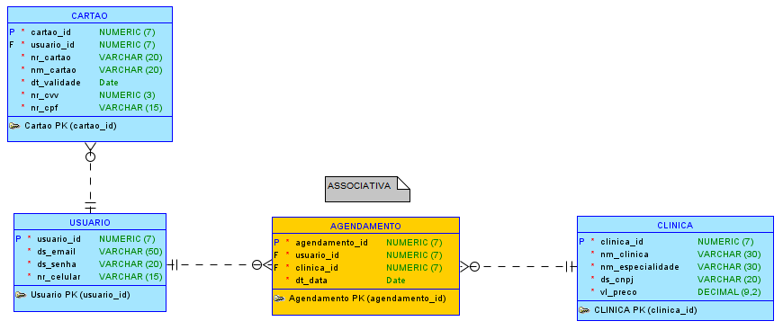

# SmartSUS

API Designada para o sistema de controle do aplicativo SmartSus, um aplicativo revolucionário que ajuda clientes a encontrar médicos próximos a preços justos. Com um simples toque no seu smartphone, você pode encontrar médicos qualificados e experientes que atendem perto de você, economizando tempo e dinheiro.

<div align="center">
    
</div>


## Endpoints
- Clínica
    - [Cadastrar](#cadastrar-clinica)
    - [Listar](#listar-clinica)
    - [Apagar](#apagar-clinica)
    - [Atualizar](#atualizar-clinica)
- Usuario
    - [Cadastrar](#cadastrar-usuario)
    - [Listar](#listar-usuario)
    - [Atualizar](#atualizar-usuario)
- Cartao virtual
    - [Cadastrar](#cadastrar-cartao)
    - [Listar](#listar-cartao)
    - [Apagar](#apagar-cartao)
- Agendamento
    - [Cadastrar](#cadastrar-agendamento)
    - [Listar](#listar-agendamento)
    - [Apagar](#apagar-agendamento)
    - [Atualizar](#atualizar-agendamento)


--------------------------------------------


### Cadastrar clinica

`POST` /api/clinicas

*Campos de requisição*

| campo | tipo | obrigatório | descrição
|-------|------|:-------------:|----------
|nome|texto|sim| nome da clinica
|especialidade|texto|sim| especialidade da clinica
|cnpj|texto|sim| cnpj da clinica
|preco|decimal|sim| preco da consulta
|clinicaId|inteiro|sim| id da clinica criada pelo sistema

*Exemplo de requisição*

```js
{
    "nome": "FIAP CLINICA",
    "especialidade": "cardiologista",
    "cnpj": "61.282.051/0001-48",
    "preco": 98.99,
    "clinicaId": 1
}
```

*Resposta*

| código | descrição 
|--------|----------
|201| a clinica foi cadastrada com sucesso
|400| campos inválidos

### Listar clinica

`GET` /api/clinicas/{id}

*Exemplo de resposta*

```js
{
    "clinicas": [
        {
            "nome": "FIAP CLINICA",
            "especialidade": "cardiologista",
            "cnpj": "61.282.051/0001-48",
            "preco": 98.99,
            "clinicaId": 1
        },
        ...
    ],
    "meta": {
        "pagination": {
            "total": 100,
            "per_page": 25,
            "current_page": 1,
            "last_page": 4,
            "next_page_url": "/api/clinicas?page=2",
            "prev_page_url": null,
            "from": 1,
            "to": 25
        }
    }
}
```

*Resposta*

| código | descrição 
|--------|----------
|200| a clinica foi cadastrada com sucesso
|404| nao foi encontrada uma clinica com esse id

### Apagar clinica

`DELETE` /api/clinicas/{id}


*Exemplo de resposta*

```js
{

}
```

*Resposta*

| código | descrição 
|--------|----------
|204| a clinica foi apagada com sucesso
|404| nao foi encontrado uma clinica com esse id

### Atualizar clinica

`PUT` /api/clinicas/{id}


*Exemplo de requisição*

```js
{
    "nome": "FIAP CLINICA",
    "especialidade": "Cirurgiao geral",
    "cnpj": "61.282.051/0001-48",
    "preco": 209.99,
    "clinicaId": 1
}
```

*Resposta*

| código | descrição 
|--------|----------
|200| os dados foram alterados com sucesso
|400| campos invalidos para alteracao
|404| não foi encontrada clinica com esse ID


--------------------------------------------

### Cadastrar usuario

`POST` /api/usuarios/

*Campos de requisição*

| campo | tipo | obrigatório | descrição
|-------|------|:-------------:|----------
|email|texto|sim| e-mail para criar o cadastro
|senha|texto|sim| senha do usuário
|celular|texto|sim| número de contato com o usuario
|usuarioId|inteiro|sim| id do usuario criado pelo sistema

*Exemplo de requisição*

```js
{
    "email": "shaolin@gmail.com",
    "senha": "aArFha251",
    "celular": "(11)9 9999-9999",
    "usuarioId": 1
}
```

*Resposta*

| código | descrição 
|--------|----------
|201| o usuario foi cadastrado com sucesso
|400| campos inválidos

### Listar usuario

`GET` /api/usuarios/{id}

*Exemplo de resposta*

```js
{
    "usuarios": [
        {
            "email": "shaolin@gmail.com",
            "senha": "aArFha251",
            "celular": "(11)9 9999-9999",
            "usuarioId": 1
        },
        ...
    ],
    "meta": {
        "pagination": {
            "total": 100,
            "per_page": 25,
            "current_page": 1,
            "last_page": 4,
            "next_page_url": "/api/usuarios?page=2",
            "prev_page_url": null,
            "from": 1,
            "to": 25
        }
    }
}
```

*Resposta*

| código | descrição 
|--------|----------
|200| os dados foram retornados
|404| não foi encontrado usuario com esse ID

### Atualizar dados da conta

`PUT` /api/usuarios/{id}

*Exemplo de requisição*

```js
{
    "email": "shaolindeporco@gmail.com",
    "senha": "DaG14@S",
    "celular": "(11)9 8888-8888",
    "usuarioId": 1
}
```

*Resposta*

| código | descrição 
|--------|----------
|200| os dados foram alterados com sucesso
|400| campos invalidos para alteracao
|404| não foi encontrado usuario com esse ID


--------------------------------------------


### Cadastrar cartao

`POST` /api/cartoes

*Campos de requisição*

| campo | tipo | obrigatório | descrição
|-------|------|:-------------:|----------
|numero|texto|sim| numero do cartao
|nome|texto|sim| nome do cartao
|validade|data|sim| validade do cartao
|cvv|inteiro|sim| digito do cartao
|cpf|texto|sim| cpf do titular
|usuarioId|inteiro|sim| id do usuario previamente criado
|cartaoId|inteiro|sim| id do cartao criado pelo sistema

*Exemplo de requisição*

```js
{
    "numero": "1234 5678 1234 5678",
    "nome": "Carthanos",
    "validade": "01/27",
    "cvv": 123,
    "cpf": "123.456.789-10",
    "usuarioId": 1,
    "cartaoId": 1
}
```

*Resposta*

| código | descrição 
|--------|----------
|201| o cartao foi cadastrado com sucesso
|400| campos inválidos

### Listar cartao

`GET` /api/cartoes/{id}

*Exemplo de resposta*

```js
{
    "numero": "1234 5678 1234 5678",
    "nome": "Carthanos",
    "validade": "01/27",
    "cvv": 123,
    "cpf": "123.456.789-10",
    "usuarioId": 1,
    "cartaoId": 1
}
```

*Resposta*

| código | descrição 
|--------|----------
|200| o cartao foi cadastrado com sucesso
|404| nao foi encontrado um cartao com esse id


### Apagar cartao

`DELETE` /api/cartoes/{id}

*Exemplo de resposta*

```js
{

}
```

*Resposta*

| código | descrição 
|--------|----------
|204| o cartao foi apagado com sucesso
|404| nao foi encontrado um cartao com esse id


--------------------------------------------

### Cadastrar agendamento

`POST` /api/agendamentos

*Campos de requisição*

| campo | tipo | obrigatório | descrição
|-------|------|:-------------:|----------
|data|data|sim| data marcada
|agendamentoId|inteiro|sim| id do agendamento criado pelo sistema
|usuarioId|inteiro|sim| id do usuario previamente criado
|clinicaId|inteiro|sim| id da clinica previamente criada

*Exemplo de requisição*

```js
{
    "data": "01-01-2024 12:00:00",
    "agendamentoId": 1,
    "usuarioId": 1,
    "clinicaId": 1
}
```

*Resposta*

| código | descrição 
|--------|----------
|201| o agendamento foi cadastrado com sucesso
|400| campos inválidos

### Listar agendamento

`GET` /api/agendamentos/{id}

*Exemplo de resposta*

```js
{
    "agendamentos": [
        {
            "data": "01-01-2024 12:00:00",
            "agendamentoId": 1,
            "usuarioId": 1,
            "clinicaId": 1
        },
        ...
    ],
    "meta": {
        "pagination": {
            "total": 100,
            "per_page": 25,
            "current_page": 1,
            "last_page": 4,
            "next_page_url": "/api/agendamentos?page=2",
            "prev_page_url": null,
            "from": 1,
            "to": 25
        }
    }
}

```

*Resposta*

| código | descrição 
|--------|----------
|200| o agendamento foi cadastrado com sucesso
|404| nao foi encontrado um agendamento com esse id

### Apagar agendamento

`DELETE` /api/agendamentos/{id}


*Exemplo de resposta*

```js
{

}
```

*Resposta*

| código | descrição 
|--------|----------
|204| o agendamento foi apagado com sucesso
|404| nao foi encontrado um agendamento com esse id

### Atualizar agendamento

`PUT` /api/agendamentos/{id}


*Exemplo de requisição*

```js
{
    "data": "01-01-2025 14:00:00",
    "agendamentoId": 1,
    "usuarioId": 1,
    "clinicaId": 1
}
```

*Resposta*

| código | descrição 
|--------|----------
|200| os dados foram alterados com sucesso
|400| campos invalidos para alteracao
|404| não foi encontrado agendamento com esse ID

--------------------------------------------
